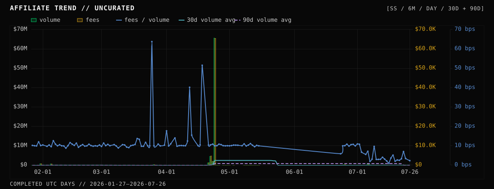
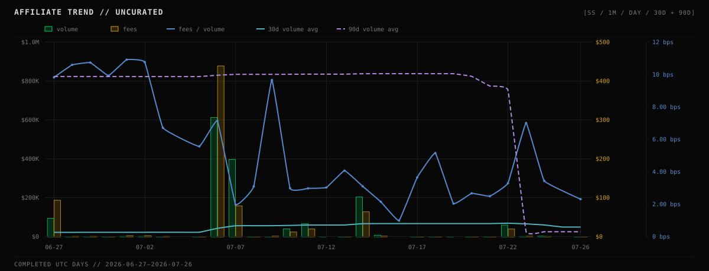
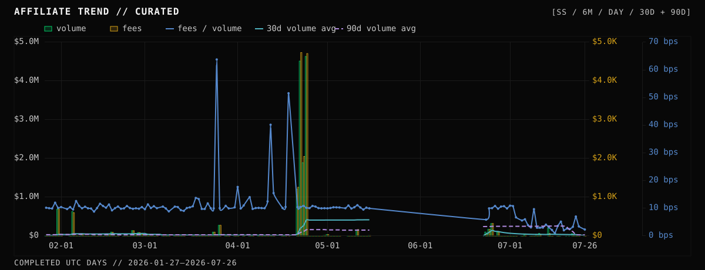
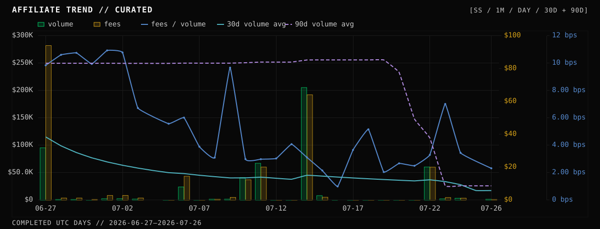

# SS dynamic-fee impact: volume and liquidity-fee generation

**Analysis date:** 2026-07-27  
**Completed-day window:** 2026-01-27 through 2026-07-26 UTC (`[2026-01-27, 2026-07-27)`)  
**Affiliate:** THORName `ss` (ShapeShift)  
**SS dynamic-fee activation:** 2026-07-03 01:43:29 UTC, height 26,841,927

## Executive conclusion

The first 23 complete post-activation days show a large reduction in the liquidity fees generated per dollar of SS volume. They do **not** yet show evidence that the lower fee floor increased curated SS volume enough to offset that reduction.

Using equal 23-eligible-day windows and omitting July 3 as the activation/cold-start day:

| View | Metric | Pre: last 23 eligible days | Post: Jul 4–26 | Change |
| --- | --- | ---: | ---: | ---: |
| Uncurated | Executed-leg volume | $897,444 | $1,406,662 | **+56.7%** |
| Uncurated | Liquidity fees | $873.20 | $643.22 | **-26.3%** |
| Uncurated | Fees / volume | 0.09730% (9.730 bps) | 0.04573% (4.573 bps) | **-53.0%** |
| Curated | Executed-leg volume | $897,444 | $419,085 | **-53.3%** |
| Curated | Liquidity fees | $873.20 | $138.85 | **-84.1%** |
| Curated | Fees / volume | 0.09730% (9.730 bps) | 0.03313% (3.313 bps) | **-65.9%** |

The uncurated volume increase is driven by three requested-for-removal routes from `thor1wqg9…s780`—identified for this analysis as **TC OG selling activity**—on July 6–7. Those routes contributed $987,578 of volume, or 70.2% of the raw post-window volume, but only 5.107 bps of fees per volume. Once removed, both volume and fee generation are substantially below the pre-period.

Endpoint-route mix does not explain away the fee-yield decline. Eleven endpoint pairs appeared in both curated equal-length windows and cover 65.5% of curated post volume. On the post-period volume for those matched routes:

- observed fees were **$88.33** at **3.217 bps**;
- applying each route's own pre-period fee yield implies **$278.35** at **10.139 bps**;
- observed fees were therefore **68.3% below** that simple route-matched counterfactual.

This supports an observed fee compression associated with the rollout that is not solely an endpoint-route-mix artifact. It does not isolate ADR-026's causal effect: the post sample is only 23 complete days, it immediately follows a five-week network halt, treatment cold-started separately by executed asset↔RUNE leg, natural slip still determines fees when it exceeds the floor, and swap-size, streaming, and route mix all changed.

## Scope and accounting

The analysis uses successful Midgard swap actions returned for affiliate member `ss`, including co-listed affiliate strings such as `ss/...`. July 27 is omitted because it was incomplete when the analysis was run. Ninety prior UTC buckets are fetched only to warm up the rolling series.

The treatment cutoff is the on-chain time when `DYNAMICFEE-WHITELIST-SS=1` became effective, not the publication time of an announcement. The feature-wide master switch had already become effective on June 30 at 23:14 UTC. The first SS action after its whitelist activation occurred July 3 at 05:48 UTC. July 3 is shown in the time series but omitted from the equal-window comparison because it was not a fully treated UTC day and executed asset↔RUNE records cold-start independently.

The metrics use the production BooneTools accounting convention:

- **Volume** is executed-leg USD. Inbound route notional is `inbound amount × Midgard inPriceUSD`, multiplied by the number of distinct executed pool legs. A cross-asset route generally contributes two legs; an asset↔RUNE route contributes one.
- **Fees** are THORChain protocol liquidity fees, not ShapeShift's affiliate payout and not outbound/network fees. Midgard's whole-route `metadata.swap.liquidityFee` is converted from RUNE to USD with that UTC day's historical RUNE/USD price.
- **Fees / volume** is `SUM(historical fee USD) / SUM(executed-leg USD)`. Ratios are not averaged across swaps or days.
- **Uncurated rolling average volume** uses fixed trailing 30- and 90-UTC-bucket spans divided by 30 and 90, respectively. Halt-day zeroes remain in the denominators.
- **Curated rolling average volume** uses the same fixed 30- and 90-calendar-day spans, removes the requested address flows from the numerators, and removes full network-halt days from both numerators and denominators. It does not reach farther back to collect 30 or 90 active observations.

Midgard exposes each streaming route as one action, so this report assigns the route's aggregate volume and fee to the action's inbound timestamp. THORChain evaluates sub-swaps at their completion heights and a long stream can cross a UTC day or controller epoch. The streams around the treatment boundary in this sample completed within their start day, and July 3 is excluded from the equal-window comparison, but the daily series remains an action-level approximation rather than a sub-swap/epoch replay.

The action-derived **fee total** reconciles to Midgard affiliate earnings within **0.03135 RUNE**, a relative difference of **0.000019%**. The action query contains 588 affiliate-member routes while the exact `ss` earnings item counts 583; the five-route difference is the five pre-treatment co-listed `ss/...` actions. Historical USD fees are recomputed because Midgard's `earningsUSD` reprices history rather than preserving the daily historical RUNE/USD value.

ADR-026 changes the minimum liquidity-fee floor for eligible SS flow; it does not guarantee that every SS swap pays the floor. Natural slip can exceed the floor, only in-scope L1 flow is affected, streaming swaps are evaluated per sub-swap, and a leg record's first cold-start swap was not dynamically priced in the deployed release. The [ADR-026 specification](https://dev.thorchain.org/architecture/adr-026-dynamic-l1-min-fee-per-thorname.html) describes the controller's revenue objective and per-affiliate/pair state. The [official explainer](https://blog.thorchain.org/adr026-dynamic-fee-model) provides rollout context.

As a treatment-scope check, the script separately requires the dominant affiliate to be `ss` and both route endpoints to use L1 asset notation. All 69 post-activation routes—and all 66 routes in the complete-day post window—pass that check. The all-SS post aggregates therefore are not currently diluted by an identified synth/trade/secured or secondary-affiliate route, although cold starts and natural-slip pricing still prevent every leg from being dynamically floor-priced.

## 1. Uncurated data

### Six-month totals

| Calendar days | Active days | Routes | Executed legs | Volume | Fees | Fees (RUNE) | Fees / volume | Mean daily volume |
| ---: | ---: | ---: | ---: | ---: | ---: | ---: | ---: | ---: |
| 181 | 131 | 588 | 940 | **$78,111,762** | **$77,603.27** | 163,964.43 | **0.09935% (9.935 bps)** | $431,557 |

These totals are not representative of ordinary SS activity. Sixteen April 24 routes from the hacked-funds address account for $60.96 million, or 78.0% of raw six-month volume by themselves.

### Six-month affiliate trend



*This uses the same mixed-series grammar as BooneTools' Affiliate Trend chart: green bars are executed-leg volume, amber bars are historical USD liquidity fees, the blue line is fees / volume, the solid cyan line is trailing 30-day average volume, and the dashed purple line is trailing 90-day average volume. The uncurated rolling series retain halt-day zeroes in their fixed denominators. Like the live chart, each view auto-scales its axes independently; use the tables rather than relative bar heights for raw-to-curated magnitude comparisons.*

### One-month affiliate trend



*This 30-completed-day view covers June 27 through July 26, including SS activation on July 3. The solid cyan 30-day line reacts more quickly to recent flow, while the dashed purple 90-day line still carries the April 24 outlier through July 22.*

### Monthly observations

January and July are partial months in this six-month window.

| Month (UTC) | Days | Volume | Fees | Fees / volume |
| --- | ---: | ---: | ---: | ---: |
| 2026-01 (Jan 27–31) | 5 | $710,406 | $719.41 | 10.127 bps |
| 2026-02 | 28 | $1,207,836 | $1,178.58 | 9.758 bps |
| 2026-03 | 31 | $568,246 | $578.87 | 10.187 bps |
| 2026-04 | 30 | $73,278,715 | $73,567.99 | 10.039 bps |
| 2026-05 | 31 | $237,645 | $255.26 | 10.741 bps |
| 2026-06 | 30 | $695,119 | $652.98 | 9.394 bps |
| 2026-07 (Jul 1–26) | 26 | $1,413,795 | $650.19 | **4.599 bps** |

The raw monthly series shows the fee yield breaking sharply lower in July, but it also contains two major distortions: the April hacked-funds burst and the July 6–7 excluded TC OG selling routes.

### Raw 90-day rolling average volume

| Date (UTC) | Daily volume | Trailing 90d average | Interpretation |
| --- | ---: | ---: | --- |
| Jan 31 | $690,278 | $39,550/day | Large ordinary-flow day |
| Feb 28 | $40,269 | $30,165/day | Pre-feature baseline |
| Mar 31 | $2,626 | $32,433/day | Pre-feature baseline |
| Apr 24 | $65,598,648 | **$841,502/day** | Hacked-address burst enters window |
| Apr 30 | $12,385 | $841,612/day | Rolling level remains outlier-dominated |
| May 15 | $11,042 | $828,500/day | Last retained partial halt boundary day |
| Jun 22 | $0 | $819,952/day | First retained restart boundary day |
| Jun 30 | $388 | $824,539/day | Dynamic master switch activates later this day |
| Jul 2 | $2,660 | $824,458/day | Last full pre-SS day |
| Jul 22 | $60,608 | $755,205/day | April 24 remains in 90-day window |
| Jul 23 | $2,224 | **$26,356/day** | April 24 falls out of window |
| Jul 26 | $1,621 | $26,366/day | Latest completed day |

The apparent July 23 collapse is a window-expiry artifact, not a delayed dynamic-fee response. April 24 is included through July 22 and falls out on July 23. The raw rolling average also divides through all 37 full halt days, as an intentionally uncurated view should.

### Equal-window impact in the raw data

The pre window is the last 23 eligible days before activation: May 4–15 and June 22–July 2. The post window is July 4–26. Both contain 21 days with at least one SS route.

These are equal retained UTC-bucket counts, not exactly equal hours of network availability: May 15 had roughly nine pre-halt trading hours and June 22 reopened only in its final minutes, while the 23 post buckets were fully available. Retaining both boundaries follows the requested day curation. A sensitivity that instead uses 23 full-availability pre days—May 2–14 and June 23–July 2—barely changes the result: raw volume **+57.6%**, fees **-25.9%**, and yield **-53.0%**; curated volume **-53.0%**, fees **-84.0%**, and yield **-66.0%**.

| Metric | Pre | Post | Change |
| --- | ---: | ---: | ---: |
| Routes | 103 | 66 | -35.9% |
| Executed legs | 171 | 98 | -42.7% |
| Volume | $897,444 | $1,406,662 | **+56.7%** |
| Mean daily volume | $39,019 | $61,159 | **+56.7%** |
| Fees | $873.20 | $643.22 | **-26.3%** |
| Mean daily fees | $37.97 | $27.97 | **-26.3%** |
| Fees / volume | 9.730 bps | 4.573 bps | **-5.157 bps (-53.0%)** |

Read alone, the raw data would suggest more volume at a much lower fee yield, with total fee generation declining despite the volume increase. The curation shows that the apparent volume gain is not robust.

## 2. Curated data

### Exclusions applied

The whole action is removed before both volume and fees are aggregated when its lowercase inbound sender matches either requested address. The full network-halt exclusion is May 16 through June 21 UTC, inclusive: 37 complete days. Partial boundary days May 15 and June 22 are retained. The [Q2 report](https://blog.thorchain.org/thorchain-quarterly-report-q2-2026) documents the five-week halt and June 22 restart; the [halt documentation](https://dev.thorchain.org/concepts/network-halts.html) distinguishes network-wide from chain-specific halt controls.

The two address exclusions and their labels are requester-supplied curation assumptions. In particular, `thor1wqg9cs2epr43aqy5e455hyyxk6qlpr6faxs780` is labeled **TC OG selling activity**. This analysis verifies the actions, amounts, dates, and sensitivity to removing them; it does not independently establish the addresses' provenance. The official THORChain exploit material cited below supports the network-halt context, not the attribution of either excluded address.

| Exclusion | Dates observed | Routes | Legs | Volume removed | Fees removed | Fees / volume |
| --- | --- | ---: | ---: | ---: | ---: | ---: |
| Full network halt | May 16–Jun 21 | 0 | 0 | $0 | $0 | — |
| `0xa6d623b871d8f5e17f1a774b19d4faffa348bdaa` | Apr 24 | 16 | 32 | **$60,964,148** | **$60,736.66** | 9.963 bps |
| `thor1wqg9cs2epr43aqy5e455hyyxk6qlpr6faxs780` (TC OG selling activity) | Jul 6–7 | 3 | 3 | **$987,578** | **$504.37** | 5.107 bps |
| Union | — | **19** | **35** | **$61,951,726** | **$61,241.04** | 9.885 bps |

Only 3.23% of routes are removed, but they represent **79.31% of raw volume** and **78.92% of raw USD fees**. Halt removal changes eligible-day and rolling-average denominators but not fee or volume totals because no SS swaps were indexed on those 37 full halt days.

### Curated six-month totals

| Calendar days | Eligible days | Active days | Routes | Executed legs | Volume | Fees | Fees (RUNE) | Fees / volume | Mean eligible-day volume |
| ---: | ---: | ---: | ---: | ---: | ---: | ---: | ---: | ---: | ---: |
| 181 | 144 | 131 | 569 | 905 | **$16,160,036** | **$16,362.23** | 35,109.25 | **0.10125% (10.125 bps)** | $112,222 |

The curated six-month yield is slightly higher than raw because the removed July routes had a low fee yield. This full-window result mostly describes the pre-feature regime and should not be used to infer the rollout's effect.

### Curated six-month affiliate trend



*The curated chart preserves the Affiliate Trend metric colors while removing the hacked-funds flow and the TC OG selling flow. It retains the halt span as empty calendar positions while excluding full halt days from curated calculations. Both rolling lines use fixed calendar spans, exclude full halt days from numerator and denominator, and are blank during the halt. Its axes auto-scale to the curated view and are not shared with the uncurated chart.*

### Curated one-month affiliate trend



*This June 27–July 26 view removes the July 6–7 TC OG selling flow from the visible bars. The dashed 90-day series also removes the April 24 hacked-address flow from its lookback through July 22. No full halt day is inside the visible range: the solid 30-day denominator stops carrying a halt-day exclusion after July 20, while the 90-day denominator excludes all 37 full halt days throughout the chart.*

### Curated monthly observations

| Month (UTC) | Eligible days | Volume | Fees | Fees / volume |
| --- | ---: | ---: | ---: | ---: |
| 2026-01 (Jan 27–31) | 5 | $710,406 | $719.41 | 10.127 bps |
| 2026-02 | 28 | $1,207,836 | $1,178.58 | 9.758 bps |
| 2026-03 | 31 | $568,246 | $578.87 | 10.187 bps |
| 2026-04 | 30 | $12,314,567 | $12,831.32 | 10.420 bps |
| 2026-05 | 15 | $237,645 | $255.26 | 10.741 bps |
| 2026-06 | 9 | $695,119 | $652.98 | 9.394 bps |
| 2026-07 (Jul 1–26) | 26 | $426,218 | $145.82 | **3.421 bps** |

After removing the requested flows, July's fee yield is 63.6% below June's. July volume is also 38.7% below June despite having nearly three times as many eligible days, underscoring that the early post-activation period has not produced a visible aggregate-volume uplift in the curated series.

### Curated 90-day rolling average volume

The `n` column is the number of retained non-halt days inside the fixed trailing 90-calendar-day span.

| Date (UTC) | Daily curated volume | Trailing 90d curated average | `n` | Interpretation |
| --- | ---: | ---: | ---: | --- |
| Jan 31 | $690,278 | $39,550/day | 90 | Pre-feature baseline |
| Feb 28 | $40,269 | $30,165/day | 90 | Pre-feature baseline |
| Mar 31 | $2,626 | $32,433/day | 90 | Pre-feature baseline |
| Apr 24 | $4,634,500 | $164,123/day | 90 | Hacked-address routes removed; other SS flow retained |
| Apr 30 | $12,385 | $164,233/day | 90 | Elevated by retained Apr 24 flow |
| May 15 | $11,042 | $151,121/day | 90 | Last retained pre-halt boundary day |
| Jun 22 | $0 | $242,104/day | 53 | Denominator excludes 37 full halt days |
| Jun 30 | $388 | $249,894/day | 53 | Dynamic master switch activates later this day |
| Jul 2 | $2,660 | $249,756/day | 53 | Last full pre-SS day |
| Jul 22 | $60,608 | $113,523/day | 53 | Last window containing Apr 24 |
| Jul 23 | $2,224 | **$26,122/day** | 53 | All Apr 24 flow expires from the window |
| Jul 26 | $1,621 | $26,139/day | 53 | Latest completed day |

The rise from May 15 to June 22 is primarily a denominator effect: the curated average stops treating 37 unavailable trading days as zero-volume opportunities. The July 23 break remains an April 24 expiry effect, although much smaller than in the raw series. On July 26, the curated fixed-span calculation has `n=53`: 29 full pre-activation eligible days, the July 3 transition day, and 23 full post days. More than half of its retained observations are therefore not fully post-treatment, so it is a lagging context measure rather than a clean estimate of a 23-day-old rollout.

### Equal-window impact after curation

| Metric | Pre: last 23 eligible days | Post: Jul 4–26 | Change |
| --- | ---: | ---: | ---: |
| Routes | 103 | 63 | **-38.8%** |
| Executed legs | 171 | 95 | -44.4% |
| Volume | $897,444 | $419,085 | **-53.3%** |
| Mean daily volume | $39,019 | $18,221 | **-53.3%** |
| Fees | $873.20 | $138.85 | **-84.1%** |
| Mean daily fees | $37.97 | $6.04 | **-84.1%** |
| Fees / volume | 9.730 bps | 3.313 bps | **-6.417 bps (-65.9%)** |

The key economic result is that fee generation fell much faster than volume. At the observed post-period volume, retaining the aggregate pre-period yield would have generated about **$407.76** in fees; observed curated fees were **$138.85**, about **$268.91 lower**. This aggregate counterfactual does not hold endpoint-route mix constant, so the route-matched test below is more informative.

### Pair-matched check

| Pair | Pre volume | Pre yield | Post volume | Post yield | Yield change |
| --- | ---: | ---: | ---: | ---: | ---: |
| BTC / ETH.USDT | $319,984 | 10.051 bps | $200,890 | 3.060 bps | -6.991 bps |
| RUNE / TCY | $4,391 | 10.472 bps | $60,299 | 3.291 bps | -7.181 bps |
| ETH.DAI / ETH | $9,710 | 9.936 bps | $10,000 | 6.086 bps | -3.850 bps |
| BCH / ETH | $147 | 10.330 bps | $1,338 | 1.525 bps | -8.805 bps |
| BTC / TCY | $126,103 | 9.828 bps | $1,133 | 3.636 bps | -6.192 bps |
| BTC / ETH | $3,999 | 9.507 bps | $365 | 3.626 bps | -5.881 bps |
| BTC / LTC | $1,649 | 10.413 bps | $271 | 4.555 bps | -5.857 bps |

All seven economically meaningful matched endpoint routes shown have lower post-period fee yield. Across all 11 matched routes, observed post fees are $88.33 versus $278.35 when post volume is priced at each route's pre yield. This supports an association with fee compression beyond changes in endpoint-route mix; it does not control swap size, streaming quantity, natural slip, or leg-level dynamic state and therefore is not causal proof.

## Interpretation

### Fee generation

The rollout is associated with lower SS liquidity fees per dollar in this initial sample. Depending on the comparison, fee yield fell from roughly 9.7–10.1 bps before activation to 3.2–3.4 bps after curation. That is consistent across the aggregate and matched-route views.

Total fee generation also fell. In the equal curated windows, volume declined 53.3%, while fees declined 84.1%. The lower fee yield therefore has not yet been offset by higher curated volume.

### Volume

The raw and curated views answer this differently:

- Raw volume rises 56.7%, but 70.2% of post-window raw volume is the three specifically excluded July routes.
- Curated volume falls 53.3%, and route count falls 38.8%.
- The post-window median daily volume falls from $2,660 to $446 after curation, so the decline is not only a totals artifact.

The defensible conclusion is **no demonstrated volume uplift yet**, not that dynamic fees caused volume to fall by exactly 53.3%. Network-restart conditions, routing competition, asset availability, and a small number of large routes remain major confounders.

### Controller-state caveat

The three removed TC OG selling routes from `thor1wqg9…s780` are excluded from the displayed curated observations, but they occurred after activation and initialized or heavily influenced SS's ETH.USDC dynamic-fee record. Removing them from an off-chain series cannot undo their effect on subsequent on-chain controller state. The curated view is therefore a sensitivity analysis of observed fee and volume flow, not a counterfactual replay of how the controller would have evolved without those routes.

### Deployed-code version caveat

Dynamic-fee behavior must be read from the Thornode tag matching the live
economic version, not from whichever local feature branch happens to be
checked out. In mainnet v3.19.x, `getMinSlipBps` immediately returns a positive
active `dynamic_bps`; it therefore replaces the network-wide
`L1SlipMinBps` fallback. Sub-10-bps SS swaps are expected when the pair's
dynamic record is below 10 bps.

The local Thornode branch
`boonew/per-asset-min-bps-mimirs-2026-05-26` contains an unshipped change that
instead takes the maximum of the asset/static floor and `dynamic_bps`. Reading
that branch as deployed code incorrectly implies that SS's 1–7 bps controller
movement was non-binding. Before interpreting later observations, query
`/thorchain/version` and inspect the matching source explicitly, for example:

```sh
git -C ../../ThorNode show v3.19.3:x/thorchain/helpers.go
```

## Bottom line

As of July 26, SS flow is showing substantially cheaper observed protocol liquidity-fee pricing after the ADR-026 rollout. Fee yield fell about **66%** in the curated equal-window comparison and about **68%** in the matched-route counterfactual. However, the first 23 complete days provide no evidence that curated volume increased enough to compensate: curated volume was **53% lower** and liquidity-fee generation was **84% lower** than in the matched pre-period.

That makes the present read **directionally negative for fee generation, inconclusive-to-negative for volume, and too early for a causal verdict**. The next useful checkpoint is after at least one full 90-day post-activation window, with the same exclusions and with leg-level dynamic state joined to every swap.

## Reproducibility and sources

Run from the website repo root:

```sh
node scripts/analyze-ss-dynamic-fee.mjs
node scripts/analyze-ss-dynamic-fee.mjs --daily-markdown
node scripts/generate-ss-dynamic-fee-charts.mjs
```

The first command emits the complete calculation as JSON; the second emits all 181 daily raw and curated rows, including the rolling-30 and rolling-90 series, as a Markdown table. The third regenerates the one-month and six-month Affiliate Trend SVG charts for both views from those same calculations.

This report freezes the values observed on 2026-07-27. The source APIs are live indexer responses and can be backfilled or corrected; a later rerun may therefore differ. The JSON output records its retrieval time and exposes action counts, interval boundaries, exclusions, and the independent fee-total reconciliation for drift checks.

The script fetches and paginates the [Midgard actions API](https://gateway.liquify.com/chain/thorchain_midgard/v2/actions?type=swap&affiliate=ss&limit=50&fromTimestamp=1761696000&timestamp=1785110400), joins the [historical RUNE/USD series](https://gateway.liquify.com/chain/thorchain_midgard/v2/history/rune?interval=day&from=1761696000&to=1785110400), and reconciles fees with the [affiliate earnings history](https://gateway.liquify.com/chain/thorchain_midgard/v2/history/affiliate/earnings?thorname=ss&interval=day&from=1761696000&to=1785110400). The exact SS activation is recorded by BooneTools' [on-chain Mimir vote history](https://boone.tools/functions/v1/node-votes/vote?key=DYNAMICFEE-WHITELIST-SS).

Local accounting references:

- [`docs/volume-accounting.md`](./volume-accounting.md)
- [`shared/dynamic-fees/affiliate-volume.js`](../shared/dynamic-fees/affiliate-volume.js)
- [`src/lib/dynamic-fees/model.js`](../src/lib/dynamic-fees/model.js)
- [`src/lib/constants/chain-events.js`](../src/lib/constants/chain-events.js)
- [`scripts/generate-ss-dynamic-fee-charts.mjs`](../scripts/generate-ss-dynamic-fee-charts.mjs)

Protocol and halt context:

- [ADR-026 specification](https://dev.thorchain.org/architecture/adr-026-dynamic-l1-min-fee-per-thorname.html)
- [THORChain dynamic-fee explainer](https://blog.thorchain.org/adr026-dynamic-fee-model)
- [THORChain Q2 2026 report](https://blog.thorchain.org/thorchain-quarterly-report-q2-2026)
- [THORChain exploit report #1](https://blog.thorchain.org/thorchain-exploit-report-1)
- [THORChain network-halt documentation](https://dev.thorchain.org/concepts/network-halts.html)
