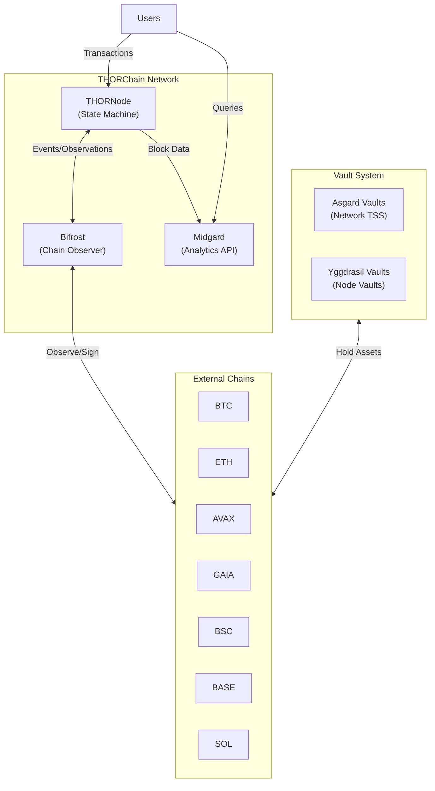
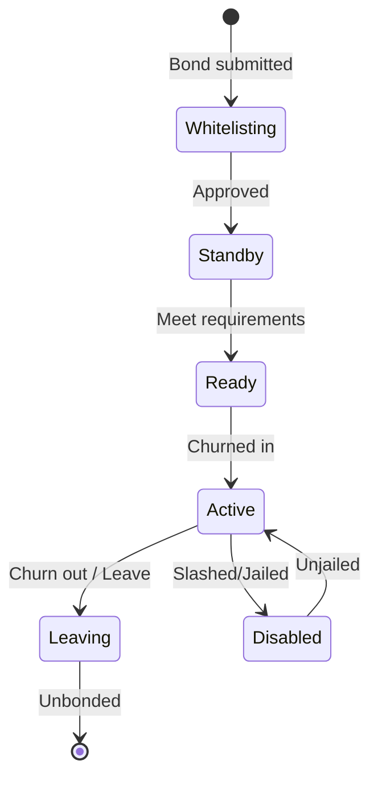

# THORChain (TC) Reference

## Overview

**THORChain** is a decentralized cross-chain liquidity protocol built on CosmosSDK. It enables native asset swaps across 11+ blockchains without wrapping or pegging assets.

**Key Features:**
- Native cross-chain swaps (BTC ↔ ETH, etc.)
- TSS (Threshold Signature Scheme) for secure vaults
- Continuous Liquidity Pools (CLPs)
- Validator network with dynamic churning (~3 days)
- Governance via Mimir parameters

---

## Architecture

### Core Services

| Service | Endpoint | Purpose |
|---------|----------|---------|
| **THORNode** | `gateway.liquify.com/chain/thorchain_api` | CosmosSDK state machine - processes swaps, manages vaults, governance |
| **Bifrost** | (runs on each validator) | Cross-chain bridge - observes external chains, signs transactions |
| **Midgard** | `gateway.liquify.com/chain/thorchain_midgard/v2` | Analytics API - aggregated data, history, offloads read queries |

### Vault Architecture

| Vault Type | Description |
|------------|-------------|
| **Asgard** | Network-controlled TSS vaults requiring 67% validator consensus |
| **Yggdrasil** | Individual node vaults for operational efficiency |

---

## Node States

| State | Description |
|-------|-------------|
| `Whitelisting` | New node joining, bond submitted |
| `Standby` | Approved, waiting for churn |
| `Ready` | Meets all requirements |
| `Active` | Actively validating transactions |
| `Leaving` | Departing network |
| `Disabled` | Slashed or jailed |

---

## Network Halts (Mimir Flags)

### Global Halts
| Flag | Effect |
|------|--------|
| `HALTRADING` | All trading stopped |
| `HALTCHAINGLOBAL` | All chains halted |

### Chain-Specific Halts
| Pattern | Example | Effect |
|---------|---------|--------|
| `HALT{CHAIN}CHAIN` | `HALTBTCCHAIN` | Chain completely halted |
| `HALT{CHAIN}TRADING` | `HALTETHTRADING` | Trading on chain halted |

### Chain States
| State | Description |
|-------|-------------|
| `halted` | Trading unavailable (global or chain-specific) |
| `trading_halted` | Pool cannot be used for swaps |
| `ragnarok` | Chain shutdown state (irreversible) |

---

## Supported Chains

| Chain | Asset | Type |
|-------|-------|------|
| THORChain | RUNE | Native |
| Bitcoin | BTC | UTXO |
| Ethereum | ETH | EVM |
| Avalanche | AVAX | EVM |
| Cosmos | GAIA | BFT |
| BSC | BNB | EVM |
| Base | ETH | EVM L2 |
| Solana | SOL | Solana |
| Bitcoin Cash | BCH | UTXO |
| Litecoin | LTC | UTXO |
| Dogecoin | DOGE | UTXO |

---

## Key API Endpoints

### THORNode (`/thorchain/...`)

| Endpoint | Purpose |
|----------|---------|
| `/pools` | All pool data |
| `/pool/{asset}` | Single pool |
| `/network` | Network stats, RUNE price |
| `/mimir` | Governance parameters |
| `/nodes` | All validators |
| `/inbound_addresses` | Deposit addresses |
| `/queue` | Transaction queues |
| `/vaults/asgard` | Network vaults |

### Midgard (`/v2/...`)

| Endpoint | Purpose |
|----------|---------|
| `/pools` | Pool analytics |
| `/stats` | Protocol statistics |
| `/history/swaps` | Swap history |
| `/history/tvl` | TVL over time |
| `/actions` | Transaction history |

---

## Resources

- [THORNode API Docs](https://gateway.liquify.com/chain/thorchain_api/thorchain/doc/)
- [Midgard API Docs](https://gateway.liquify.com/chain/thorchain_midgard/v2/doc)
- [THORChain Dev Docs](https://dev.thorchain.org)
- [Nine Realms Ops](https://ops.ninerealms.com/links)
